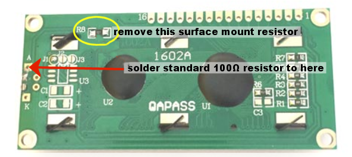
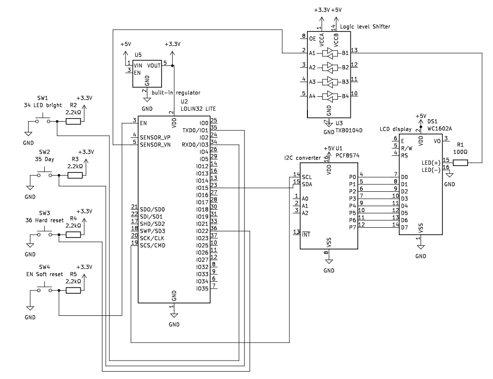
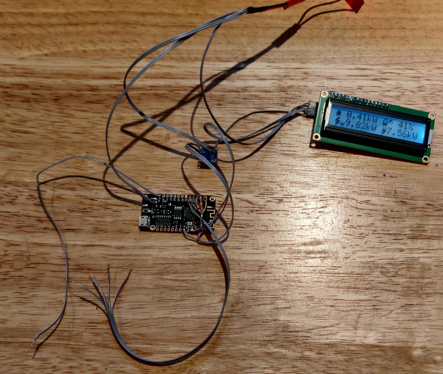
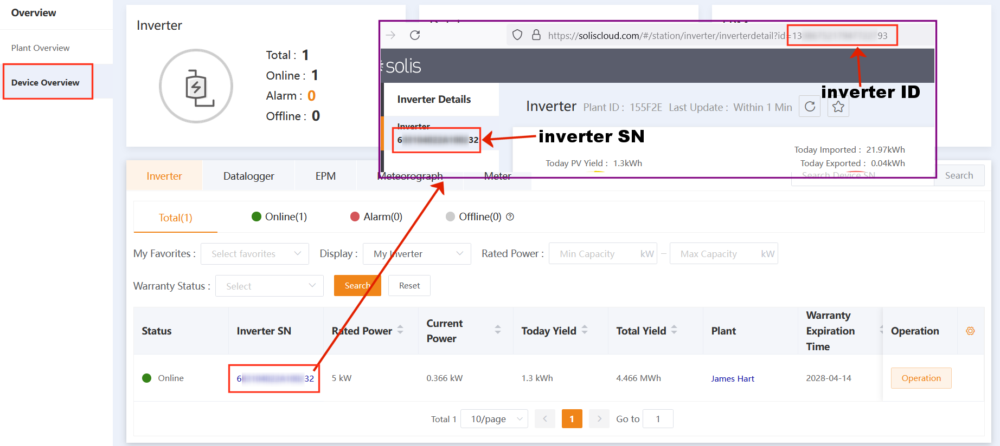

# Solis Cloud API display for ESP32

A version of a Solis Cloud API solar display using MicroPython and a 1602 LCD screen, for the ESP32 board.

It uses the [Solis API](https://solis-service.solisinverters.com/en/support/solutions/articles/44002212561-api-access-soliscloud) which allows users of Solis inverters to collect current and historical data, and displays it on a handy little screen.

### Note: ESP32 only
This currently doesn't work on a WeMos D1mini (and maybe other ESP8266 devices) because of this:
[github.com/micropython/micropython-lib/issues/400](https://github.com/micropython/micropython-lib/issues/400) 

## Hardware
Here's what I used to make my version:
- Wemos LOLIN32 LITE (or off-brand equivalent ESP32)
- HD44780 based 1602 LCD screen
- PCF8574 based I2C interface
- 100Ω resistor
- 4 channel logic level shifter
- 5x 2kΩ resistor pull-ups
- a mini USB charging board (to get 5V from a micro USB connector)
- a 5V power supply
- a collection of miscellaneous push buttons

These are all (currently) available for a total of less than £10 from your favourite online electronics retailer.

I'm using a WEMOS LOLIN32 LITE which has just about enough memory and processing power to do the job. 

There's no reason why it can't work with another ESP32 device - a WEMOS S2MINI is smaller, for example. You'd need to adjust the pins to suit, obviously.

The LOLIN32 LITE has a handy battery input that goes into a voltage regulator rated at 6V, so I desoldered that and used it for the 5V input to the board.

The LCD display I'm using is a 1602 one based on the HD44780 controller, and an PCF8574 I2C interface.

I'm using a PWM-capable output pin to drive the backlight LED, so I used a logic level converter (since it needs 5V and the PWM output pin is only 3.3v) to drive it, and desoldered the on-board resistor. I think some of the I2C interfaces come with a jumper, so removing the resistor might not be required.

#### Pins used:
- 5 - LED PWM output
- 19 - I2C SCL
- 23 - I2C SDA
- 34 - LED brightness button
- 35 - Day summmary button
- 36 - Hard reset button
- EN - Soft reset button

### Circuit diagram
Here's my attempt at the circuit diagram - it looks a lot more complicated than it actually is, and Kicad doesn't have the symbol for a Lolin32 so it's only a close approximation (and a hot mess, if I'm honest).

All it really needs is a 5v power input, with three connections - one to the input of the ESP32, one to the level shifter and one to the LCD display. The rest is just data lines to the various push buttons and display inputs.

I included 2.2k resistors as pullups since the internal ones don't seem to work too well (having read up about it, they're closer to 10k and therefore a bit floaty).

## Software
To get this working you'll first need to install MicroPython on your device. The instructions at [docs.micropython.org](https://docs.micropython.org/en/latest/esp32/tutorial/intro.html) are clear and easy to follow.

I use Microsoft [Visual Studio Code](https://code.visualstudio.com/) with the [Pymakr-preview](https://marketplace.visualstudio.com/items?itemName=pycom.pymakr-preview) extension installed (**note:** it's the preview version that, at time of writing, actually works. For some reason the standard version doesn't!)

It should be fairly straightforward to copy the code to the device.

### Libraries used
I made use of the following excellent libraries - and I'm grateful to the developers for making my life so much easier!

- https://github.com/dhylands/python_lcd ([*homepage*](https://www.davehylands.com/))
- https://github.com/anson-vandoren/esp8266-captive-portal ([*blog post*](https://ansonvandoren.com/posts/esp8266-captive-web-portal-part-1/))

### Requirements
To use this, you'll need access to the soliscloud monitor API. This is well-documented on the [solis-inverters.com](https://solis-service.solisinverters.com/en/support/solutions/articles/44002212561-api-access-soliscloud) website.

Once you have access to the API, you'll need:
- Solis API Key - available from the [API management page](https://soliscloud.com/#/apiManage)
- Solis API Secret - as above
- The ID of your Solis inverter. This can be found by clicking on the [Device Overview](https://soliscloud.com/#/station/device) of the soliscloud website, and then clicking on the serial number of the inverter
- The Serial number of your Solis inverter. This is the number you clicked on above

### How it works

#### boot.py
The `boot.py` section generally deals with setting the credentials for the wifi network and Solis API. It loads a captive portal with an SSID starting `SolarDisplay-` and once you've connected to it with a handy device and web browser, you can enter the appropriate information there. Once it's done, it should reset and start displaying the data.

#### main.py
This runs a bunch of uasyncio loops, mainly to make web service calls to Solis every 45 seconds. While it's doing that, a dot appears around the middle of the bottom row of the screen. If it's successful, the dot disappears. If it's unsuccessful, it turns into two dots. 

The button on Pin 35 - if there is information available - prints the current daily solar generation, and the time of the last update by the datalogger (it only updates every five minutes). 

If there's been a problem with getting data, the last HTTP response code from solis cloud will be displayed, in order to help with diagnosis (for example, if the key/secret/id/serial combination are wrong, it'll return a 403).

The button on Pin 34 increases the brightness of the LED until it gets to maxium, then goes to 0

The button on Pin 36 is the hard reset button - hold it for 3 seconds and it clears the credentials and restarts at the captive portal.

Finally, the reset button does a normal reset on the ESP32, in case it's got stuck or something.

## 3D printed case

In the docs/Case design folder you can find 3MF and STL files for the case design. The PCBs are intended to click into the rear section, and the display clicks into the front. 
